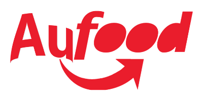
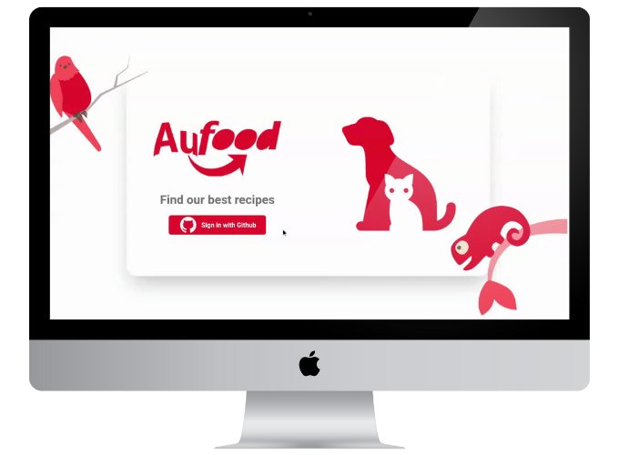
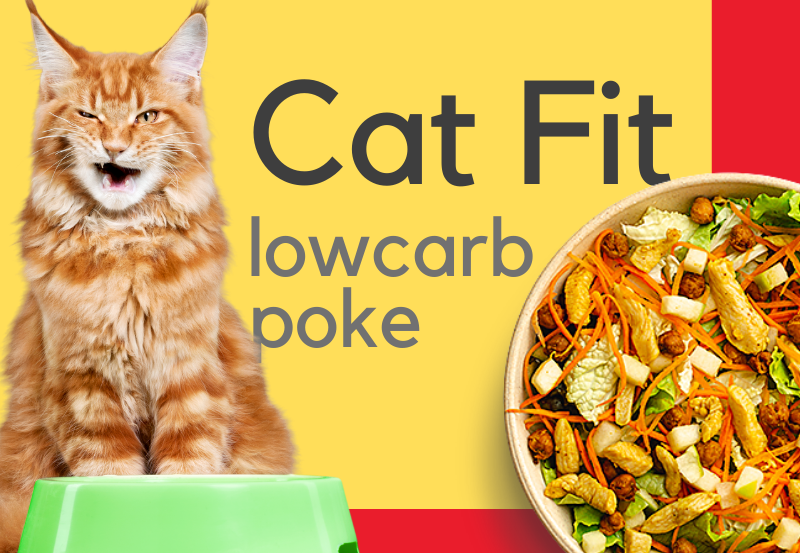
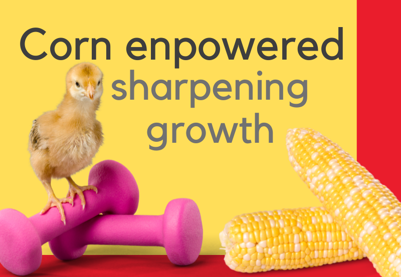
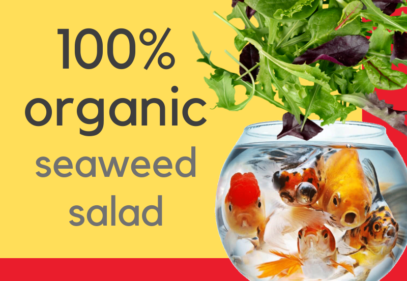

<h1 align="center">
    
</h1>
<br>
<p align="center">
  <a href="#desktop_computer-project"></a>&nbsp;
  <a href="#nail_care-layout"></a>&nbsp;
  <a href="#technologist-technologies"></a>
  <a href="#octocat-environment"></a>&nbsp;
  <a href="#bookmark_tabs-license"></a>&nbsp;
</p>

<p align="center">
 
</p>
<hr>

## :desktop_computer: Project

The purpose of creating <Strong>Aufood</Strong> is to challenge me and put knowledge in frontend into practice.

I'm one of those who believe that you only learn by doing, that's why I tried to use several features in this project.

Aufood was designed and created without the help of more experienced developers. Some ideas, theme and inspiration I got from a delivery service in Brazil called [Ifood](https://www.ifood.com.br/).

If you see something in my code that I can improve I would love to hear from you. I think every feedback is an opportunity to improve so I'm waiting for your PR or contact. 💌

I was able to learn a lot about:

- React-Components,
- React-Props,
- React-Hooks,
- Context,
- Animation libraries,
- Axios,
- SSG pages,
- SPA pages,
- Slug,
- Declarative UI,
- Performance strategys,
- Next-Auth,
- Json-server as Fake-Api,
- SwiperJS,
- much more...

>`Alert 1:` Due to some features in the styling, it is not recommended use olders browsers.

>`Alert 2:` The project doesn't have a responsive version for mobiles but I tried to cover several screen sizes.

>`Alert 3:` All images used were taken from a paid [Canvas](https://www.canva.com/) license. Some are related to a copyright.


## :nail_care: Layout
<p align="center">


</p>
<hr>

## :stuck_out_tongue_winking_eye: Some fun arts

<p align="center">


</p>

<p align="center">



</p>

<p align="center">



</p>

## :technologist: Technologies

- [React](https://pt-br.reactjs.org/)
- [Next.js](https://nextjs.org/)
- [Typescript](https://www.typescriptlang.org/)
- [Chakra-UI](https://chakra-ui.com/)
- [Swiper](https://swiperjs.com/)
- [JSON Server](https://www.npmjs.com/package/json-server)
- [TypeWriter](https://www.npmjs.com/package/typewriter-effect)
<hr>

## :octocat: Environment

Keep in mind that the following installations will be needed:

- [Git](https://git-scm.com/book/pt-br/v2/Come%C3%A7ando-Instalando-o-Git)
- [Yarn](https://classic.yarnpkg.com/en/docs/install/#debian-stable)

Follow the instructions to run the application:

1. Clone the repository: 
```bash 
git@github.com:CaioLemec/aufood.git
```
2. Install all dependencies by using command:
```bash
yarn
```
3. In the project root, find and rename .env.local.exemple to .env.local following inside instructions:
```bash
Follow the instructions inside to fill the environment variables.
```
4. At your terminal set this command line to get JSON Server running:
```bash
yarn server
```
5. Open anoter terminal and set this command line:
```bash
yarn dev
```
6. Access the generated address in your browser:
```bash
http://localhost:3000/
```
<hr>

## :bookmark_tabs: License

Licensed under MIT [LICENSE](./LICENSE.md).

<hr>

I am available for any clarification. 
    

<h3>Caio Lemec<h3>
<a href="https://t.me/caiolemec">
<a href="mailto:caiolemec@gmail.com">
<a href="https://www.linkedin.com/in/caiolemec/">
<br>
</p>
